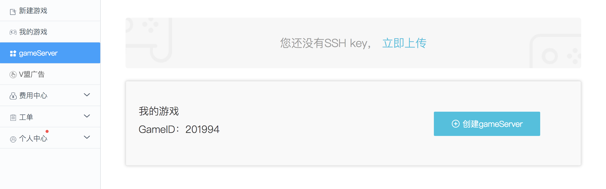
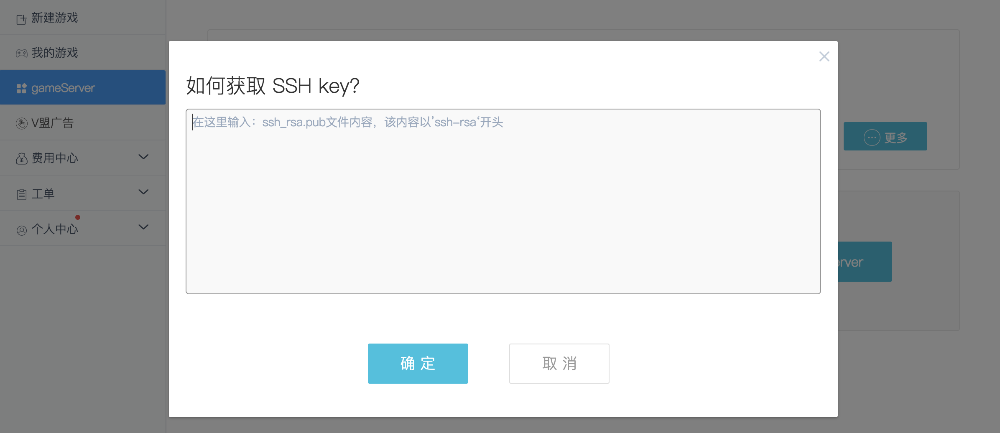
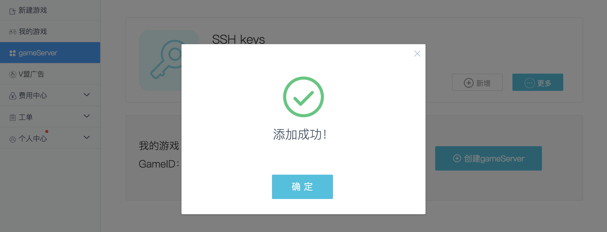
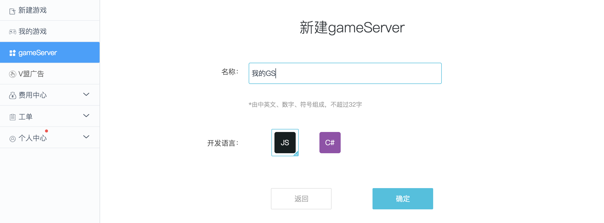
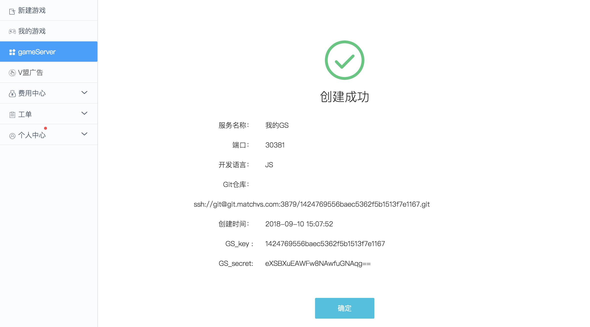
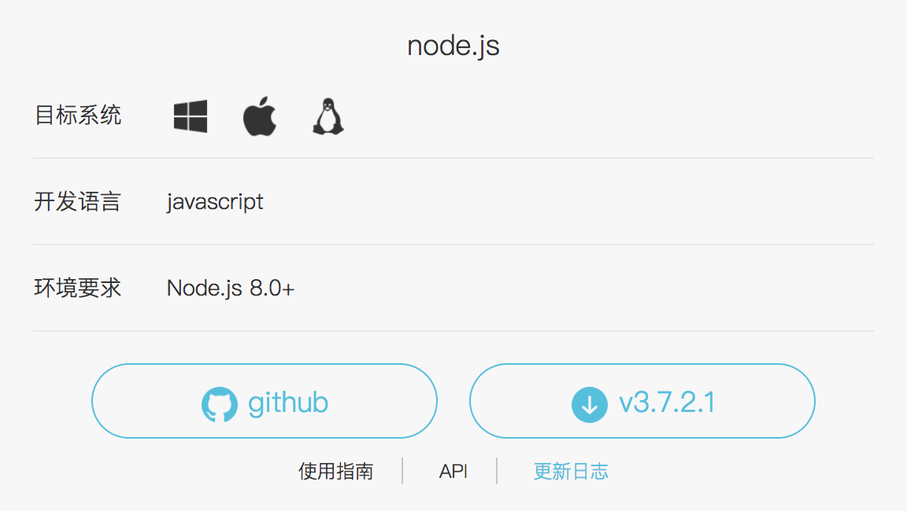
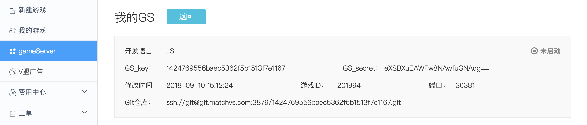

## 创建游戏

在开始使用 gameServer 之前，你需要创建自己的游戏。如何创建游戏详见 [Matchvs快速入门](新手上路-Matchvs[MatchvsStart].md)。


## 创建 gameServer

成功创建游戏后，点击左侧菜单栏 “gameServer” 即可进入 gameServer 列表页。



Matchvs 使用 git 管理 gameServer，所以在创建 gameServer 之前，你需要将自己的 SSH key 上传至 Matchvs 账号。

1. 复制 SSH key 到粘贴板

   SSH key 文件通常位于 `~/.ssh/id_rsa.pub`。如果文件不存在，请参阅 git 手册生成 SSH key。

2. 点击上图中的 “立即上传”

   

   把第1步复制的内容粘贴到输入框，注意不要输入多余的空格或空行，点击确定。

3. 确定上传成功

   

SSH key 上传成功后，点击 “创建gameServer”，填写 gameServer 基本信息：



创建成功后的 gameServer 相关信息展示：



gameServer 创建成功后，Matchvs 会为每个 gameServer 分配一个唯一的 git 仓库地址。在本示例中，Matchvs 分配的 git 仓库地址为： `ssh://git@git.matchvs.com:3879/1424769556baec5362f5b1513f7e1167.git`。下一小节将介绍如何使用 git 仓库。


## 下载 gameServer 框架代码

拿到 git 仓库地址后，使用 git 命令将 gameServer 仓库克隆到本地：

```shell
$ git clone ssh://git@git.matchvs.com:3879/1424769556baec5362f5b1513f7e1167.git myGameServer
Cloning into 'myGameServer'...
warning: You appear to have cloned an empty repository.
```

因为这是一个新的 git 仓库，所以在克隆成功后 git 工具会发出一条警告，忽略该警告信息即可。

前往[下载中心](http://www.matchvs.com/serviceDownload)，下载 Node.js 版本的 gameServer 框架（框架版本可能有更新，以官网展示为准）:



下载完成并解压，将解压后的所有文件复制到 `myGameServer`目录下，这时的文件结构如下所示：

```shell
myGameServer
├── .gitignore
├── Dockerfile
├── Makefile
├── README.md
├── conf
│   └── config.json
├── gsmeta
├── main.js
├── package.json
└── src
    └── app.js
```

请保证目录结构完整，否则可能出现 gameServer 无法发布的情况。


## 本地开发环境

[Node.js](https://nodejs.org) gameServer 支持 Node.js 8.0 及以上版本。


## 本地开发调试

gameServer 配置文件路径为`myGameServer/conf/config.json`，其中包含以下默认配置项：

- **addr**：gameServer服务监听地址。IP默认为 “0.0.0.0” 即可，不建议修改。端口号可以从官网查询到：

  

  该端口号由系统在创建 gameServer 时分配以保证全局唯一性。

  **gameServer 只能使用系统分配的端口号，否则发布上线后将无法正常提供服务。**

- **logLevel**：日志配置。gameServer 使用 [log4js](https://www.npmjs.com/package/log4js) 作为日志管理框架，如需自定义 log 输出可在了解 log4js 的前提下自行修改配置文件。

- **register**：独立部署配置，仅在使用 Matchvs 独立部署解决方案时开启。

  - enable：register 注册服务控制开关，设为 true 时开启独立部署模式，设为 false 时关闭独立部署模式。
  - gameID：开发者自定义游戏ID。
  - svcName：gameServer 服务名，与 podName 组合作为该 gameServer 的唯一标识。 
  - podName：gameServer 实例名，与 svcName 组合作为该 gameServer 的唯一标识。
  - remoteHost：gameServer 注册服务地址，由独立部署方案提供。
  - remotePort：gameServer 注册服务端口，由独立部署方案提供。
  - localHost：gameServer 对外服务地址，该地址需要能被独立部署的引擎服务访问。
  - localPort：gameServer 对外服务端口。

- **roomConf**：gameServer 支持房间管理功能，开发者通过在 gameServer 里调用 API 接口可以实现房间创建、设置房间存活时常和房间删除等操作。如需在本地调试时使用房间管理功能，则需要开启 roomConf 配置。

  - enable：房间管理服务控制开关，设为 true 时开启房间管理服务，设为 false 时关闭房间管理服务。
  - svcName：gameServer 服务名，开启`matchvs debug`时在终端显示，与 podName 组合作为该 gameServer 的唯一标识。
  - podName：gameServer 实例名，开启`matchvs debug`时在终端显示，与 svcName 组合作为该 gameServer 的唯一标识。
  - remoteHost：gameServer 房间管理服务地址，开启`matchvs debug`时在终端显示。
  - remotePort：gameServer  房间管理服务端口，开启`matchvs debug`时在终端显示。

为了方便开发者在开发过程中快速调试和定位问题，matchvs 命令行工具提供了本地调试命令`matchvs debug <GS_key>`。使用时只需把 <GS_key> 替换为需要开启本地调试的 gameServer 的 GS_key，然后执行命令即可开启本地调试。例如：

```shell
$ matchvs debug 1424769556baec5362f5b1513f7e1167
	==================== Develop config ====================
	SvcName:        svc-201994-0
	PodName:        deploy-201994-0-5f5d8785f8-9545j
	RemoteHost:     directory10.matchvs.com
	RemotePort:     9982
```

开启本地调试模式后，启动本地 gameServer 服务：

```shell
$ cd myGameServer
$ npm install
$ node main.js
```

本地搭建项目时，`npm install`失败或进度慢,可尝试使用`cnpm install`。

`npm install`和`cnpm install`混用时报错,建议删除`node_modules`, 重新使用一种方式安装。

如果想要退出调试，在Matchvs命令行终端输入`quit`回车即可。


## Demo 客户端与 gameServer 建立连接

本地调试模式只支持测试环境，所以 Demo 客户端需要切换到测试环境，即 Demo 配置文件中的 `channel`需要修改为 `Matchvs`，`platform`需要修改为`alpha`。

运行Demo客户端，此时Matchvs 引擎就会将客户端的请求转发到开发者本地 gameServer 服务，开发者无须提交代码即可在本地调试代码。


## 查看日志

gameServer 运行日志会输出到终端：

```shell
$ node main.js
[2018-09-10T18:43:26.012] [INFO] default - Game server started, listen on: 0.0.0.0:30381
[2018-09-10T18:47:40.370] [DEBUG] default - onCreateRoom: { userID: 0,
  gameID: 201994,
  roomID: '1679176138263367775',
  createExtInfo:
   { userID: 324973,
     userProfile: Uint8Array [ 117, 115, 101, 114, 80, 114, 111, 102, 105, 108, 101 ],
     roomID: '1679176138263367775',
     state: 1,
     maxPlayer: 3,
     mode: 0,
     canWatch: 0,
     roomProperty: Uint8Array [  ],
     createFlag: 1,
     createTime: '1536576460' } }
```

