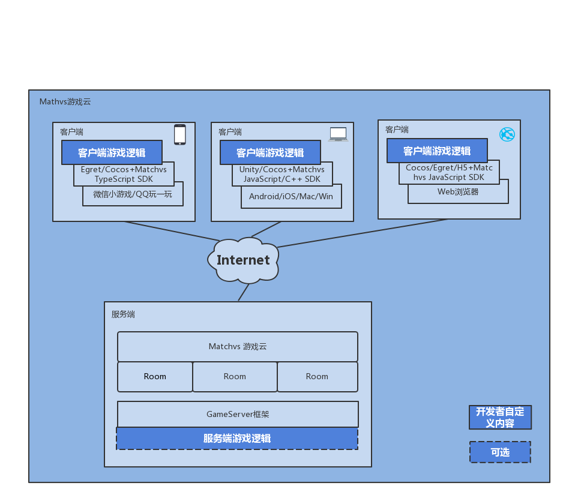

# 概述

Matchvs游戏云（简称“Matchvs”）为开发者提供游戏联网通信解决方案，拥有快速接入联网、多节点、低延迟、云端一键部署、可定制扩展等特色。

适用于多应用场景，包括立项之初接入与后续单机改造，只需要简单调用Matchvs提供的SDK，就可以接入Matchvs服务，实现多人实时在线联网。遍布全国的服务器节点和独创的“服务器帧同步”技术，使接入Matchvs的游戏享受多节点带来的即时同步保障，游戏数据传输更及时，解决联网游戏因延迟限制玩法的痛点。

## 高效接入

Matchvs将游戏的大厅、房间、游戏交互等流程通用化，深入了解开发者的需求并设计出易用的接口，配套以完善的Demo，易于开发者理解并降低学习成本，开发者只需专注游戏本身品质。

## 灵活匹配

可自定义的匹配机制，满足开发者的游戏在不同规则、场景下的匹配需求，适用目前市场上主流的联网、对战、社交等类型游戏，极大的丰富了游戏玩法。

## gameServer Framework

在获得了基础的联网能力之后，Matchvs还为游戏开发者提供了基于联网的服务端框架——gameServer Framework。通过gameServer Framework，开发者可以对服务端的联网能力进行扩展，实现自定义的服务端逻辑。

## V盟广告

V盟广告是深圳市掌玩网络技术有限公司历时2年打造的移动互联网广告联盟，以其特有的免安装功能大幅优化了普通广告联盟繁琐的用户操作过程，为渠道合作伙伴提供流量变现的整体解决方案。同样的产品及用户规模，V盟广告可以立竿见影地帮助合作伙伴提升3-5倍的广告收益，目前追书神器、视频头条、换机精灵等超级app陆续加入V盟阵营，赶快加入[v盟广告](http://union.matchvs.com/#/) 为您的游戏变现创收吧。

