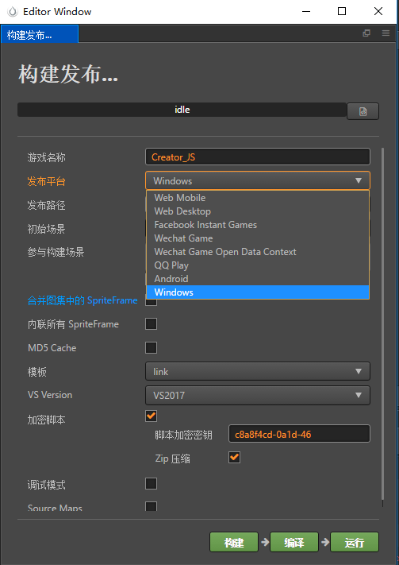
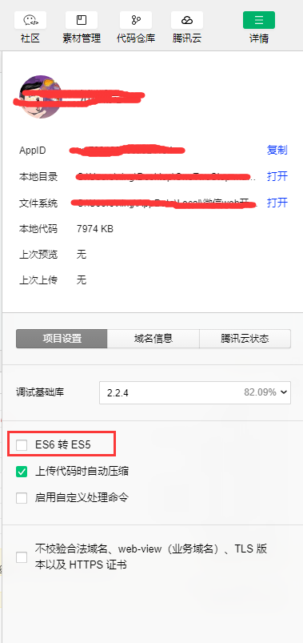

## 发布到web平台

打开主菜单的 `项目` -> `构建发布`，打开构建发布面板。

Cocos Creator 提供了两种 Web 平台的页面模板，可以通过 发布平台 的下拉菜单选择 Web Mobile 或 Web Desktop，他们的区别主要在于 Web Mobile 会默认将游戏视图撑满整个浏览器窗口，而 Web Desktop 允许在发布时指定一个游戏视图的分辨率，而且之后游戏视图也不会随着浏览器窗口大小变化而变化。

## 发布到Native平台

- Native平台包括Android、iOS、Mac、Windows 四个平台

在SDK3.7.3.0版本之后，不在采用JSB加载的方式。

Native平台的编译和预览请参考cocos[原生平台发布](http://docs.cocos.com/creator/manual/zh/publish/publish-native.html)

## 发布到微信小游戏平台

> **注意** 微信小游戏平台发布成功后，使用微信web开发者工具打开工程，在真机预览时，一定要 **勾选ES6转ES5** ，微信小游戏平台还不完整的支持ES6的个别语法

- 由于微信小游戏包体为4MB，可以把部分资源放到远程服务器上进行下载
- 还可以通过 `项目` -> `项目设置` -> `模块设置`，将没有使用的模块不勾选，压缩包体体积。

## 发布到Facebook Instant Games

Matchvs支持发布到FaceBook，无需做多余适配，按照cocos发布流程即可参考[cocos发布Facebook instant Games](http://docs.cocos.com/creator/manual/zh/publish/publish-fb-instant-games.html)

## 发布到QQ玩一玩

在SDK3.7.3.0版本之后，Matchvs支持了QQ玩一玩。无需多余适配工作，发布流程参考[cocos发布QQ 玩一玩](http://docs.cocos.com/creator/manual/zh/publish/publish-qqplay.html)