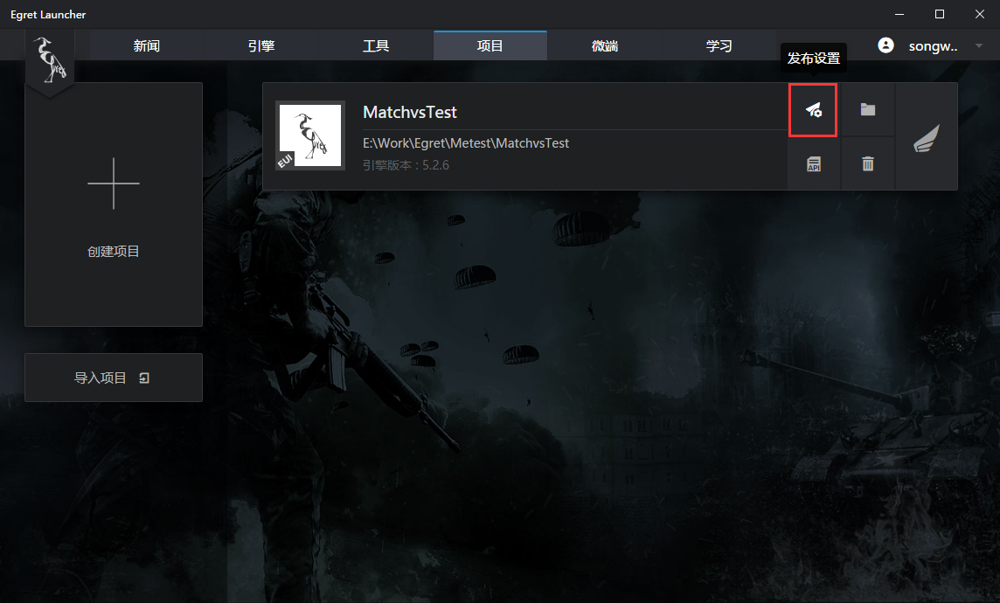
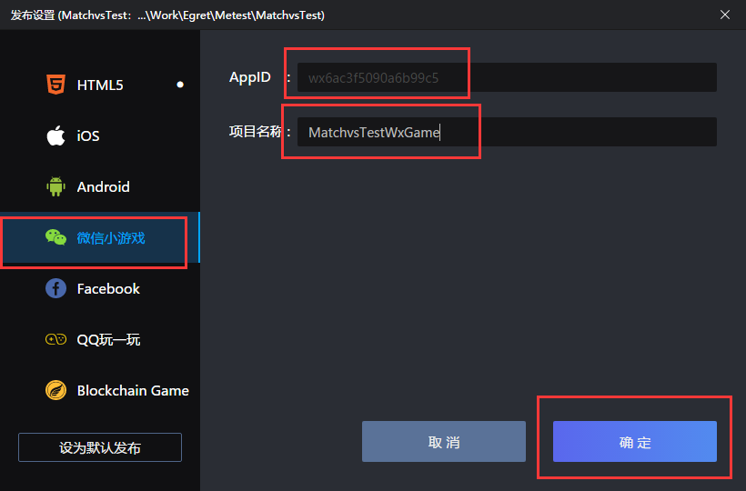

# Matchvs 集成项目发布

集成Matchvs SDK 同时支持多个平台的发布，几乎与egret发布多平台是完美想嵌的。

- HTML5 
- IOS
- Android
- 微信小游戏
- Facebook
- QQ玩一玩

## HTML5 

打开 Egret Lanucher 定位到项目页面，点击发布按钮如下图：

点击发布按钮，会弹出发布配置页面，在这里可以选择你想发布的任何支持的平台，同时我们Matchvs也是支持的。如下图所示：

点击确定后会有发布成功的提示，打开相应的目录，找到index.html 文件打开就可以了。

## 微信小游戏

#### 发布微信小游戏之前准备：

1. 请到 [微信公众平台](https://mp.weixin.qq.com/) 注册小游戏。

2. 下载安装小游戏开发者工具 (登录到微信公众平台后可以找到下载地址)。

#### 发布微信小游戏

微信小游戏发布可以参考 [Egret的教程](http://developer.egret.com/cn/github/egret-docs/Engine2D/minigame/publish/index.html) 。也可在满足 Egret最新支持的微信小游戏版本发布的条件情况下直接在 Egret 发布设置界面中选择微信小程序，如下图：

> 注意：要填好AppID 和项目名称。这个AppID是在 [微信公众平台](https://mp.weixin.qq.com/) 中注册的游戏信息。

微信小游戏发布成功可以选择使用微信开发者工具打开。打开可能会有点慢，等个一分钟就可以了，如果还没有打开，自己打开微信开发者工具打开导入刚刚发布的小程序。

打开刚刚使用 Egret发布的微信小程序可能会遇到，**fixedWidth**  模式不匹配问题，可参考下图配置：

把`game.js` 文件下的scaleMode改为fixedWidth，和不验证合法域名，配置好后就可以啦！

## QQ玩一玩平台发布

发布流程和前面述说的是一样。发布完成会包含以下两个目录：

- PublicBrickEngineGame ：这里是玩一玩相关的代码，PublicBrickEngineGame/Res 目录下代码就是用来打包QQ玩一玩的文件。
- PublicBrickEngineGame.xcodeproj：这里是在xcode上调试项目的工程。

具体如何把使用已经发布好的QQ玩一玩代码可以参考 [egret相关教程](http://developer.egret.com/cn/github/egret-docs/Engine2D/bricksgame/start/index.html) ，以及 [QQ轻游](http://hudong.qq.com/) 相关说明。

## 其他平台请查看 [Egret发布教程](http://developer.egret.com/cn/github/egret-docs/Engine2D/publish/index.html) 

