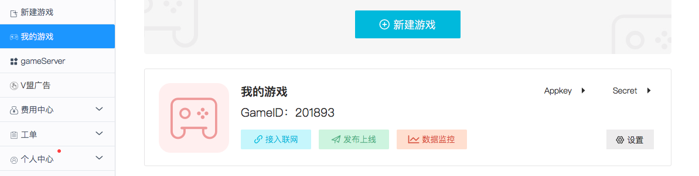
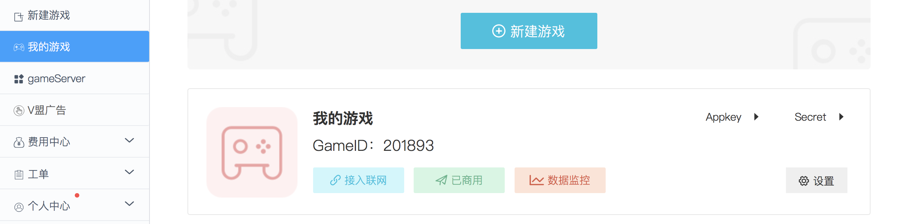
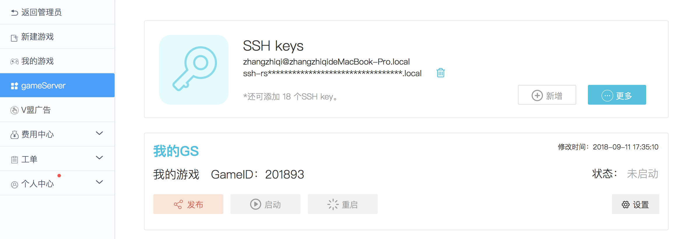
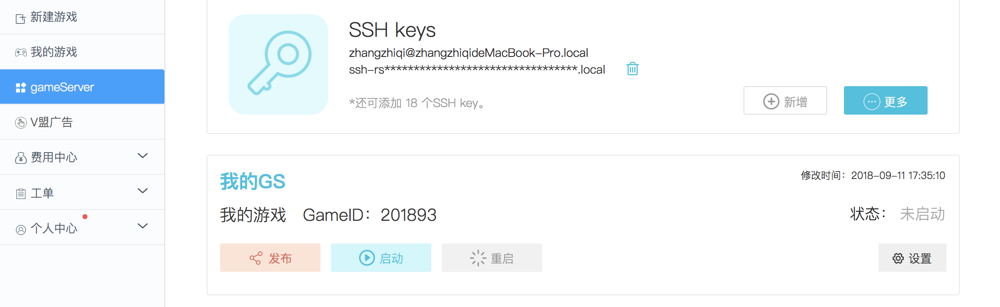

本文演示了 gameServer 开发完成后正式上线的流程。


## 推送代码

gameServer 本地开发调试完成后需要将代码推送到 Matchvs 远程仓库，这里以 Node.js 版 gameServer 为例演示使用 git 命令推送代码的流程，其它语言的 gameServer 与此流程一致。如果你使用的是 git GUI 工具，请参考相应的工具使用说明。

1. 查看 git 仓库当前状态

   ```shell
   $ git status
   On branch master
   
   No commits yet
   
   Untracked files:
     (use "git add <file>..." to include in what will be committed)
   
   	Dockerfile
   	Makefile
   	README.md
   	conf/
   	gsmeta
   	main.js
   	package.json
   	src/
   
   nothing added to commit but untracked files present (use "git add" to track)
   ```

2. 添加到暂存区

   ```shell
   $ git add -A
   ```

   该命令将所有修改的文件添加到暂存区。如果只想添加指定的文件可以使用：

   ```shell
   $ git add [file]
   ```

3. 提交到本地仓库

   ```shell
   $ git commit -m 'init code'
   [master (root-commit) 473e2ae] init code
    8 files changed, 360 insertions(+)
    create mode 100755 Dockerfile
    create mode 100755 Makefile
    create mode 100755 README.md
    create mode 100755 conf/config.json
    create mode 100755 gsmeta
    create mode 100755 main.js
    create mode 100755 package.json
    create mode 100755 src/app.js
   ```

4. 上传本地代码到远程仓库

   ```shell
   $ git push
   Enumerating objects: 12, done.
   Counting objects: 100% (12/12), done.
   Delta compression using up to 8 threads.
   Compressing objects: 100% (9/9), done.
   Writing objects: 100% (12/12), 4.08 KiB | 2.04 MiB/s, done.
   Total 12 (delta 0), reused 0 (delta 0)
   remote: =============== Begin build App ========================
   remote:   % Total    % Received % Xferd  Average Speed   Time    Time     Time  Current
   remote:                                  Dload  Upload   Total   Spent    Left  Speed
   remote:   0     0    0     0    0     0      0      0 --:--:-- --:--:-- --:--:--remote:   0     0    0     0    0     0      0      0 --:--:-- --:--:-- --:--:--remote: 100    53    0     0  100    53      0     49  0:00:01  0:00:01 --:--:--remote: 100    53    0     0  100    53      0     25  0:00:02  0:00:02 --:--:--remote: 100    53    0     0  100    53      0     17  0:00:03  0:00:03 --:--:--remote: 100    53    0     0  100    53      0     13  0:00:04  0:00:04 --:--:--remote: 100    53    0     0  100    53      0     10  0:00:05  0:00:05 --:--:--remote: 100    53    0     0  100    53      0      8  0:00:06  0:00:06 --:--:--remote: 100    87  100    34  100    53      5      8  0:00:06  0:00:06 --:--:--     0
   remote: build status:  0
   remote: Build Successful !!
   remote: =============== End build App ===========================
   To ssh://git.matchvs.com:3879/1424769556baec5362f5b1513f7e1167.git
    * [new branch]      master -> master
   ```

   推送结果显示：`remote: Build Successful !!`表示代码已经成功推送到了 Matchvs 远程仓库，并且构建成功。如果推送失败则会显示相应的错误原因。

## 发布上线

### 发布游戏

发布 gameServer 的前提是游戏已经发布上线，否则 gameServer将会发布失败。

前往 Matchvs 官网控制台：



点击”我的游戏“进入我的游戏列表，选择要发布的游戏点击”发布上线“，确定之后会提交给管理员审核，管理员审核通过之后游戏状态变更为“已商用”，即已发布上线。




### 发布 gameServer

**gameServer 发布上线之前，请确保：**

**1. 游戏已经发布上线**；

**2. 本地调试通过，并且已经将代码推送到 Matchvs 远程仓库。**


前往 Matchvs 官网控制台：



点击”gameServer“进入我的gameServer列表，选择要发布的 gameServer 点击“发布”，发布成功之后“启动”按钮变成可点击状态，点击“启动”即可启动 gameServer。

