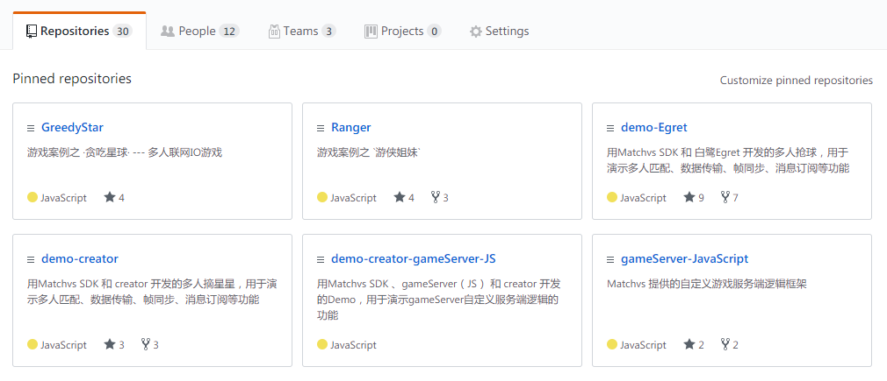

## Matchvs案例和Demo

[TOC]

​ 

-------------------------

## 概述

### 案例

   `案例`是以商业级别的水准来制作,揽括当前游戏行业的流行元素,面向游戏策划者展示Matchvs游戏云的支撑能力

### Demo

    `Demo` 相比案例,更侧重于站在工程师的角度,以游戏开发语言如`JavaScript`/`TypeScript`/`C#`/`C++` 和游戏开发引擎如`Cocos2D-X`/`Cocos Creator`/`Egret`/`Unity`向游戏开发工程师阐述Matchvs的能力. 演示登录,匹配,数据传输,实时同步等联网游戏必备的功能使用场景和使用方法.

## 1.案例

### 1.1 案例专题页（在线体验）

[http://www.matchvs.com/clientcase](http://www.matchvs.com/clientcase)

### 1.2 案例列表

#### - 贪吃星球
  https://github.com/matchvs/GreedyStar

#### - 游侠姐妹
  https://github.com/matchvs/Ranger

#### - 三人斗地主
  https://github.com/matchvs/Poke

#### - 多人狩猎
  https://github.com/matchvs/DuckHunt.git

#### - 激流竞速
  https://github.com/matchvs/OneTwoStep.git

#### - 组对吃鸡
  https://github.com/matchvs/BirdWar.git

#### - 双人跳跳
  https://github.com/matchvs/JumpJump

#### - 红蓝狙击
  https://github.com/matchvs/DoubleShoot

#### - 金币赢家
  https://github.com/matchvs/RobCoin

#### - 挑衅大师兄 
  https://github.com/matchvs/ShaoLinTemple.git

#### - 生存竞赛
  https://github.com/matchvs/ExtremeEvasion

#### - 炸弹对攻
  https://github.com/matchvs/BasketBall

#### - 斗兽棋
  https://github.com/matchvs/AnimalChecker

#### - 萌鸟连连看
  https://github.com/matchvs/CuddlyBird

#### - 疯狂足球

## 2. Demo

### 2.1 Demo列表

#### 2.1.1 demo-Creator(JavaScript)

    用Matchvs SDK 和 creator 开发的多人摘星星，用于演示多人匹配、数据传输、帧同步、消息订阅等功能 

https://github.com/matchvs/demo-creator

https://github.com/matchvs/demo-creator-gameServer-JS(带GameServer)

#### 2.1.2 demo-Laya(TypeScirpt)

  用Matchvs SDK 和 Laya 开发的多人抢球，用于演示多人匹配、数据传输、帧同步、消息订阅等功能 

https://github.com/matchvs/demo-Laya

#### 2.1.3 demo-Egret(TypeScirpt)

  用Matchvs SDK 和 白鹭Egret 开发的多人抢球，用于演示多人匹配、数据传输、帧同步、消息订阅等功能 

https://github.com/matchvs/demo-Egret

#### 2.1.4 demo-Unity(C#)

  用Matchvs SDK 和 unity 开发的多人竞速，用于演示多人匹配、数据传输、帧同步、消息订阅等功能 

https://github.com/matchvs/demo-unity

https://github.com/matchvs/gameServer-Csharp(带GameServer)

#### 2.1.5 demo-Cocos2DX(C++)

  用Matchvs SDK 和 cocos-2dx 开发的双人对战，用于演示随机匹配、数据传输等功能 

https://github.com/matchvs/demo-cocos2dx