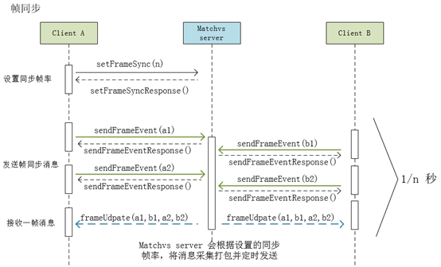
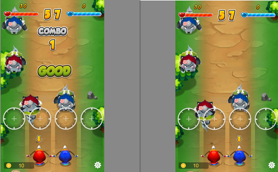
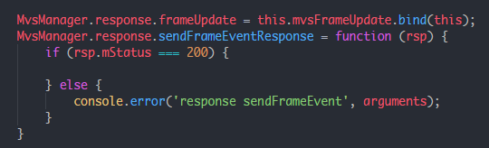
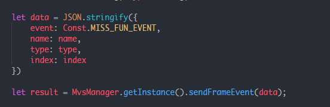
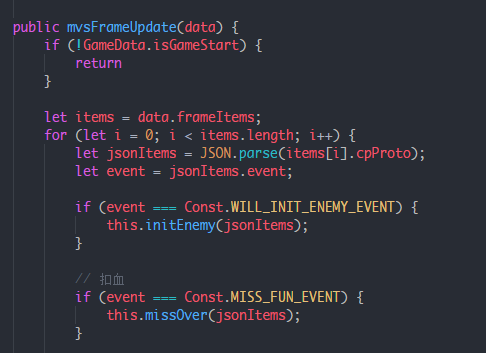

/*
Title: 帧同步示例教程
Sort: 27
*/

# 帧同步示例教程

帧同步方案就是一种解决这类问题的方案。帧同步的原理就是保证所有客户端每个逻辑帧的输入都一样。

#### 帧同步客户端技术要点

- 确保核心战斗每帧输入输出一致性。

- 逻辑帧与渲染帧隔离。 逻辑帧需要确定性，且不受渲染的差异影响。

- 伪随机数算法。确保种子一致的情况下，在任何机器任何时间下获得相同的随机数序列。

为了确保第一条中的每帧输入输出一致性,我们需要用到服务器.但对于为个人游戏开发者或者小团队开发者，租一套的服务器并且开发完善服务器功能，费钱费时，成本过高。 所以这时选择一款满足上述需求的游戏云服务器引擎就成为一个节省成本的好方法.

Matchvs 游戏云服务提供了一个叫 [帧同步](http://www.matchvs.com/service?page=netExtensionJS) 的游戏服务

从Matchvs的官网我们可以发现它的flag； 实时云，帧同步，云端部署。

云端部署，简单方便，不用自己买服务器。对小游戏来说，是一个福利。Matchvs作为国内的出于速度上的考虑，使用它的服务器，一定程度上也加快的其内部的访问速度。

 #### 帧同步游戏案例

小游戏“游侠姐妹”，玩法类似与节奏大师。不同的是，双方玩家共用同一个屏幕、场景与战场体系，双方均可见对方血量、分数、障碍物。双方将只能消除自身的障碍物获得分数（红蓝分组），消除对方的障碍物将失去部分生命值。

- UI用Egret游戏引擎，Egret有一整套工具来支撑UI上的开发.

- 网络用Matchvs 的JavaScript SDK配合Matchvs的云服务完成通信这个环节的开发

 同步机制采用Matchvs使用的是帧同步策略，定时触发同步但不等待。客户端定时上报消息，服务器定时下发数据给客户端，延迟高的客户端不会拖累其他人。对于画面同步，我们实现的方式很简单。数据同步帧和渲染帧分离的情况下，收到同步帧数据，驱动渲染帧渲染。

#### Matchvs SDK 接口调用技巧

首先在发送事件之前， 我们设置下同步帧的帧率，使用接口setFrameSync，一般设置为10(看你的项目要求)。这时， 我们发送帧同步数据，sdk只会在每整100ms( 1s / 你设置的帧率大小)时发送一次数据包，这个数据包括这段时间内的所有数据包(也可称之为这一帧的数据)， 接收方就可以接到这一帧的数据。

具体的使用方法是；我们先用接口setFrameSync设置帧率，然后，我们再选择进入游戏界面，用接口sendFrameEvent 发送帧同步事件(比如；游戏战斗情况实时事件)，此时，房间内所有玩家通过绑定frameUpdate回调事件，就可以接受到这一帧的数据

我们的实现；

玩家点击按钮射箭的判断以后，把消息通过接口sendFrameEvent发送出去，但是该玩家不立即处理客户端画面， 当玩家(包括该玩家)通过接口frameUpdate接受到数据，再修改客户端画面，从而实现同步。

- 基本原则；先绑定，再使用

- 发送帧同步事件(其实和普通接口一样的使用方式)

- 接受帧同步数据， 根据不同的event判断不同的事件

Matchvs解决了服务器延迟和同步问题，节省了很多时间。写一个小游戏分享出去，是一件很有趣的事情。项目开发前的准备一定要充分，对使用的引擎或者工具，要有一定的熟悉度和了解。整体和细节规划一样重要。如果对引擎某一块功能不是很熟，可以考虑下对这部分功能跑个demo，测测功能和性能。从网上得来的结论，不一定是准确的，性能好不好，使用过一段时间才知道。开头就一心扑在既定的规则上，可能会把项目弄糟，实践之后，再知道适不适合你的项目。

