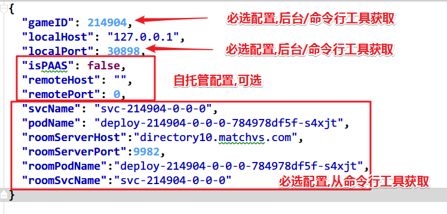

/*
Title: 快速入门-GameServer-Java
Sort: 7
*/

# Java-GameServer 开发文档

### 开发环境

需要java开发环境 下载JDK环境,参考[JDK安装与环境变量配置](https://jingyan.baidu.com/article/6dad5075d1dc40a123e36ea3.html) 

### 下载Java Gaamerver 框架代码

下载完并解压得到一个文件夹，

```shell
java-gameServer
├── demo         示例工程，修改工程中的App.Java文件即可
├── Config.json  配置文件
├── Dockerfile   docker文件不可修改
├── gsmeta       gameServer配置文件，不可修改。
├── Makefile     配置文件，不可修改。
├── README.md
```

使用IDE工具打开JavaGameServer工程。 `IDE`工具建议使用`IDEA`或者`Eclipse`

### 本地开发调试

先搭建本地环境,下载相关工具,详细见: <https://doc.matchvs.com/QuickStart/gsQuickStart>

对与java,需要注意

在APP.java文件中 path填入本地配置文件信息。配置文件参考下载文件中的Config.json文件。

```Java
public static void main(String[] args) {
	String[] path = new String[1];
	//本地调试时在此处填写自己config.Json的绝对路径,正式发布上线注释下行代码即可。
	//path[0] = "C:\\Users\\xing\\Desktop\\java-gameServe\\Config.json";
	try {
		Main.main(path);
	} catch (Exception e) {
		e.printStackTrace();
	}
}
```
启动本地项目 就可以进入调试状态。

> 注意: Java版本GameServer是线程安全的,线程模型类似NodeJS.对接受消息的处理,无须考虑线程安全问题,但要特别注意,**绝对**不能`堵塞主线程`,否则客户端会收到`520`错误码(很多开发者在主线程操作远程数据库碰到了客户端520问题)


### Config配置

具体规则见<https://doc.matchvs.com/QuickStart/gsQuickStart#Config%20配置>



- isPAAS：独立部署配置，仅在使用 Matchvs 独立部署解决方案时开启。默认为false
- remoteServerHost：gameServer 房间管理服务地址，开启`matchvs debug`时在终端显示。
- remoteServerPort：gameServer  房间管理服务端口，开启`matchvs debug`时在终端显示。

**注意** 上述文件仅本地调试时才会被用到. 发布上线是时应被移除

### Demo 客户端与 gameServer 建立连接

本地调试模式只支持测试环境，所以 Demo 客户端需要切换到测试环境，即 Demo 配置文件中的 `channel`需要修改为 `Matchvs`，`platform`需要修改为`alpha`, `GameID` 需要和Config.json文件中的`GameID`一致。

### 查看日志

日志必须使用提供的Logger。

```Java
Logger log = LoggerFactory.getLogger("App");
```

gameServer 本地调试运行日志在IDE的输出终端查看，线上调试再官网的控制台查看。


### 上线

代码编写完成后，将demo工程打成jar包，必须命名为`GameServer-Java.jar`(Jar包必须为可执行Jar包，入口类为App.java)，上传到git仓库。

**注意** GameServer在线上环境读取的是`GameServer-Java.jar`同级目录下的Config.json文件的配置。

git仓库文件列表为

```shell
java-gameServer
├── demo
├── Config.json   
├── Dockerfile
├── gsmeta
├── GameServer-Java.jar
├── Makefile
├── README.md
```

从控制台启动。GameServer现网启动需要游戏转商用后才可以 转商用参考  [Matchvs环境说明](../Advanced/EnvGuide)


