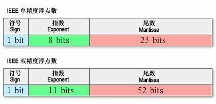

/*
Title: 定点数
Sort: 62
*/

定点数概念和浮点数一起来说更容易理解

## 什么是浮点数

当前(2019年)计算机由于空间限制,无法用`0,1`表示很高精度的小数,比如pi(3.1415926....)

而浮点类型就是计算机用有限空间来表示此类小数的方法,其世界通用规则为1985制定`ANSI/IEEE Std 754-1985` .  

 

图中64位的浮点数(double)其中用1位表示正负,11位表示小数点位数,剩下52位表示具体数值. 

显而易见,32位(float)没有64位(double)浮点数的能够表达的精度高.


# 定点数

定点数相对来说就是 精度是固定的.小数点后位数固定,`不会有double和float的精度区别`,以PI为例子

如果用浮点数表示,Java和JS分别是

```java
System.out.println(Math.PI);//3.14159265358979323846
```

```javascirpt
console.log(Math.PI); //JS:3.141592653589793
```

两种语言在精度上有不同.

用定点数,PI就可以表示为`3.1415926`.

## 什么时候需要使用定点数

`PI`在Java和JavaScript中的大小有不同,这种不同在游戏中会造成那些问题呢?

假如一款采用`帧同步`的联机游戏中程序要判断是否角色是否被一个AOE的打中(在圆圈内),各个客户端需要用`PI`或者开`平方根`来计算吧, 而客户端一个是Java写的, 一个是JS写的,在某些临界条件下. 两个不同语言的客户端产生不同的结果,一个中了AOE挂了. 一个没中, 还活着, 造成不同步.

这个时候需要用到`定点数`,强制设定不同语言,不同设备浮点数运算的精度一致.


## 定点数怎么实现

定点数怎么实现

最简单的方法, 浮点数先乘个10000 (有越界风险),取整,去掉精度, 再除10000.  

js取整:
> Math.floor(Math.PI*1000)

java取整:
> (int)(Math.PI*1000)

相关定点数库:
> c# : https://github.com/asik/FixedMath.Net/blob/master/src/Fix64.cs
>
> JS: https://mikemcl.github.io/decimal.js