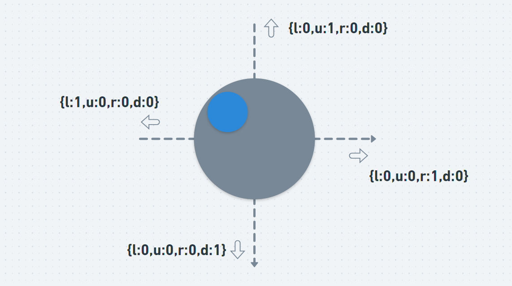
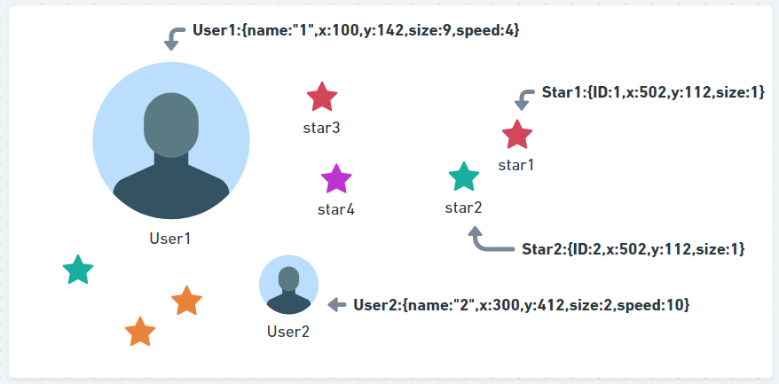
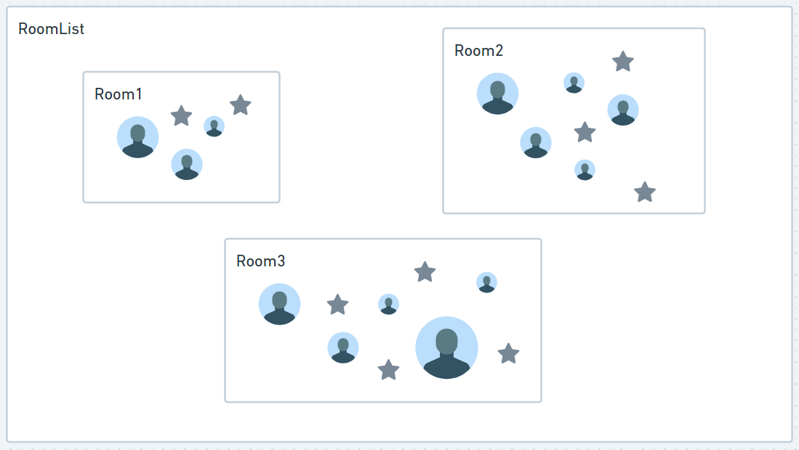
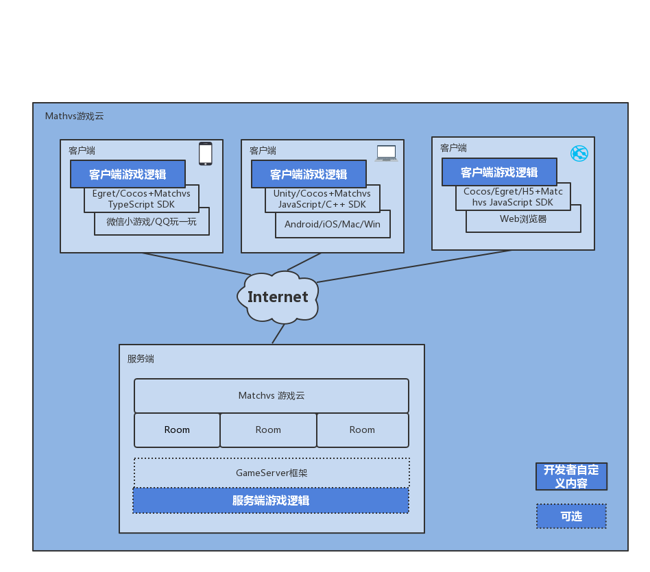

/*
Title: 贪吃星球gameServer开发教程
Sort: 47
*/

# GameServer开发笔记 - 贪吃星球 - IO类游戏


##  游戏特性剖析

贪吃星球为典型的IO游戏 , 玩家化身一个星球在有限的地图吞食地图上的小星星或者弱小的星球(玩家)不断壮大自身 , 同时又要避免被更强大的星球(玩家)吞食, 其核心玩法为:

- 多人联网
- 实时对抗 
- 地图限制 
- 死后即刻复活

> 什么是IO游戏:http://www.973.com/z62475


## 游戏设计

#### 框架 - Client&Server

因此游戏实时联网对抗的特性,需要实时同步各个玩家的位置 , 且存在资源(星星,星球)竞相吞食的竞态场景 , 再加上手机移动设备网络延迟抖动的存在 , 故采用`Client`+`Server`的CS架构来解决同步问题.
- `Server端` 负责`位置`的计算,和多方吞食胜者的`判定`,`食物`的生成
- `Client端` 负责玩家移动,食物的`画面表现渲染`和`用户按键`输入的`上报


#### 房间匹配制 - 在线玩家分组

考虑到IO游戏对地图活动范围有限制,进而对同场景下的`最大(max)`游戏人数也有限制,故而需要把所有玩家分割成独立的若干个小组 , 这和酒店的开房间类似, 3人间,5人间等,  即 `房间制` . 通过`JDGE`把玩家匹配到各个房间,`Server端` 把`Room`作为管理游戏世界的最小操作单元 .


## 关键数据结构

贪吃星球中的玩家可以移动, 可以吞食小星星,可以吞食其他玩家,故使用 `Input`+`User` +`Food`三个类来描述游戏中的每一个的事物


#### Input - 描述玩家的行为

贪吃星球中玩家的操作可以抽象为 `上,下,左,右,加速` 5个行为, 每个行为仅有`按下,松开`2个状态 ,这里用一个`Input`类来描述  . 

```java
public class Input {
    //0为松开,1为按下
    public int l;//左
    public int r;
    public int u;//上
    public int d;
    public int p;//加速
}
```

`Client`负责上报每个玩家的`Input`给`Server`端,`Server`端收到后更新每个玩家的`user.input` , 得意后续用来计算玩家下一步的位置,检测玩家是否与食物或者其他玩家产生碰撞(以下简称为碰撞检测)




#### User - 描述玩家的状态

贪吃星球中的玩家有X,Y坐标 , 当前的速度(speed), 成长值(size,size越大,speed越小),当前的输入状态(input)
> User
```Java
public class User {
    public String name;
    public int status;
    public int score;
    public int size; //体积
    public int x;
    public int y;
    public int speed;
    public transient Input input;
}
```


#### Food - 描述游戏中的食物(小星星)
> Food 
```java
public class Food {

    public int x;
    public int y;
    public int score;
    public int ID;
    public int size;
}
```



#### Room - 描述游戏场景

再使用一个 `Room`来概括整个游戏场景. 即:

```JSON
RoomList:
[
    room1 : {
        userList : [User1 , User2, ...],
        foodList : [Food1 , Food2, ...]
    }
    room2 : { ...},
    ...
    ..
    .
]
```
> Room
```java
public class Room {
    public List<User> userList; //玩家列表
    public List<Food> foodList ; //星星列表
}
```



## 游戏开发

### 开发环境的搭建
#### Server端开发
#####  Server端的框架选择
- 如果从头开发一个服务端, 需要解决与客户端的网络通信问题, 协议的选择, 硬件和带宽资源的采购,以及客户端有可能存在H5/Android/iOS/Win的多个版本 , 从无到有,再做到稳定和兼容性俱佳,无疑费时费力, 所以这里借助 JDGE 的GameServer框架与 JDGE 客户端SDK提供的通信能力, 在此基础上进行二次开发事半功倍, 这里选用GameServer的大众版本 - Java版本作为`server`端开发的基础框架, 需要电脑上安装Java(JDK1.8+)的开发环境 .

> JDGE GS和 JDGE SDK关系如下图:
> 
>
> - 2.下载包含Java版本GS框架的示例工程代码  (下载地址:https://github.com/matchvs/GameServer-Java)
- 3.本案例使用的IDE为 `IntelliJ IDEA`，也可以使用其他开发工具进行开发，例如Eclipse 使用IDE打开`demo`工程。
> JDGE GameServer开发框架的具体的使用文档:https://doc-ge.matrix.jdcloud.com/QuickStart/GameServer-Java

##### Server端的RoomMap模块开发
玩家被`JDGE`匹配到一个房间中时,会与GS框架通信,在GameServer的App.java类中能收到这个信息.  所以需要在App.java中使用一个`Map`来管理`Room`,控制room的新建和销毁

- 玩家被`JDGE`分配到一个房间时,需要先检查这个房间是否在`Map`中存在,没有则新建Room
- 玩家与`JDGE`断开网络连接从`Map`中移除Room

具体做法为:

拓展 App.java中的 `onReceive` 函数. 监听`client`端的中的`checkin`事件(玩家checkin即进入房间事件)

```java
 @Override
    public boolean onReceive(Simple.Package.Frame clientEvent, StreamObserver<Simple.Package.Frame> clientChannel) throws InvalidProtocolBufferException {
        super.onReceive(clientEvent, clientChannel);
        Gsmvs.Request request = Gsmvs.Request.parseFrom(clientEvent.getMessage());
        switch (clientEvent.getCmdId()) {
            // 玩家checkin
            case Gshotel.HotelGsCmdID.HotelPlayerCheckin_VALUE:
                log.debug("玩家进入房间成功(CheckIn):  userID:"+request.getUserID());
                JoinRoom(request,clientChannel);
                break;
        }
   }
```


处理玩家被匹配到房间中的逻辑, 新建/修改上述设计中的`Room`数据 ,并将数据同步给`client`端
```java
    private void JoinRoom(Gsmvs.Request request, StreamObserver<Simple.Package.Frame> clientChannel) {
        GameServerMsg msg;
        long roomID = request.getRoomID();
		//判断是否房间需要新创建
        if (!roomMap.containsKey(roomID)) {
            roomMap.put(roomID, new GreedyStarRoom(roomID, clientChannel,this));
            //获取当前房间的食物列表
            for (int i = room.foodList.size(); i < Const.FOOD_INITIAL_NUB; i++) {
                Food food = Food.addFood(room.foodNum);
                room.foodList.add(food);
                room.foodNum = room.foodList.size();
            }
            //给新进入的玩家同步当前的食物
            //....
        }
        room = roomMap.get(roomID);
        //给前面的玩家同步新进入玩家的信息
        ArrayList<GreedStarUser> arrayList = new ArrayList<>();
        if (arrayList.size() > 0 ) {
            msg = new GameServerMsg("otherPlayer",arrayList);
            sendMsgToOtherUserInRoom(roomID, JsonUtil.toString(msg).getBytes(),new int[]{request.getUserID()});
        }
        

    }
```


##### Server端的Room模块开发

一局游戏,从开始到结束都应该被封装在Room中,通过一个循环按`固定频率`来检查玩家的input值,将变化的部分同步给`client`端,平滑的推动此局游戏的进程

```java
public class Room {
    Runnable runnable = new Runnable() { 
      @Override
        public void run() {
         checkInputState();
         checkBorderCollide();
         checkUserCollide();
         checkFoodCollide();
        }
    }
    Room (){
        //利用GS的定时器循环调用room的run方法,线程安全.
        Main.gameServer.setInterval(runnable, 33);//33为毫秒
    }
    public void destroy() {
        log.info("销毁定时器");
        Main.gameServer.clearInterval(runnable);
    }
    
    /**
     * 检查玩家与玩家之间的碰撞
     */
    public void checkUserCollide();    
    /**
     * 检查玩家与食物的碰撞
     */
    public void checkFoodCollide();
    /**
     * 检查玩家的input,修改玩家的xy坐标
     */
    public boolean checkInputState();
    /**
     * 检查玩家与地图边界的碰撞
     */
    private void checkBorderCollide() ;
    
    
  
 }   
```

##### Server端的Input模块开发
`server`端根据玩家在`client`端的输入(`input`)来更新玩家的状态,并同步给其他`client`端

- 监听来自`client`端的`Input`消息,更新玩家状态
```java
 @Override
    public boolean onReceive(Simple.Package.Frame clientEvent, StreamObserver<Simple.Package.Frame> clientChannel) throws InvalidProtocolBufferException {
        super.onReceive(clientEvent, clientChannel);
        Gsmvs.Request request = Gsmvs.Request.parseFrom(clientEvent.getMessage());
        switch (clientEvent.getCmdId()) {
                       case Gshotel.HotelGsCmdID.HotelBroadcastCMDID_VALUE:
                Gshotel.HotelBroadcast boardMsg = Gshotel.HotelBroadcast.parseFrom(clientEvent.getMessage());
                String msg = boardMsg.getCpProto().toStringUtf8();
                try {
                    examplePush(boardMsg.getRoomID(),boardMsg.getUserID(),msg);
                } catch (JSONException e) {
                    e.printStackTrace();
                }
                break;
        }
   }
```

- 处理来自`client`端的`Input`消息,
> 注意:这里没有直接去改变User的xy做坐标,而只是更新user.input值. user.xy值的改变是在上文所说的循环中进行的 .  这样做的好处是避免`client`端频繁的上报`input`消息 ,`server`立刻响应并同步新的xy坐标给`client`端造成上下行网络堵塞,丢包卡顿 

```java
    private void examplePush(long roomID, int userID, String msg) throws JSONException {
        JSONObject jsonObject = new JSONObject(msg);
        switch ( jsonObject.getString("type")) {
            case "input":
                room = roomMap.get(roomID);
                //gs 停止时，玩家创建房间，gs 未存储房间，此处需要判断空,调试时常遇到
                if (room != null && room.userList != null) {
                    for (int i = 0; i <room.userList.size() ; i++) {
                        if (userID == room.userList.get(i).userID) {
                            room.userList.get(i).input = JsonUtil.fromJson(jsonObject.getString("data"),Input.class);
                            break;
                        }
                    }
                }
```
### Client端开发

客户端用CocosCreator开发,
只要做两件事情, 

- 监听触摸屏/按键时间,上报`Input`给`server`

- 接收来自`server`的user和food信息,渲染画面

具体见 Game.js的`onUIEvent`函数和Joystick.js的`initInput`函数

> Game.js (https://github.com/matchvs/GreedyStar/blob/refactoring/GreedyStarClient/assets/scripts/Game/Game.js)
> Joystick.js 
> https://github.com/matchvs/GreedyStar/blob/refactoring/GreedyStarClient/assets/scripts/Game/Control/Joystick.js

关键代码注释:

```javascript
onUIEvent(event) {
        var particleSystem ;
        var color;
        let colorArr = utils.getRandomColor();
        switch (event.type) {
            case "addFood":
                //渲染食物新生的游戏场景
                break;
            case "removeFood":
                //渲染食物被吃的游戏场景
                break;
            case "addPlayer":
                //渲染自己进入游戏的场景
                break;
            case "otherPlayer":
                //渲染其他玩家进入游戏的场景
                break;
            case "removePlayer":
                //渲染其他玩家离开游戏的场景
                break;
            case "move":
                //渲染玩家的位置和size变化
                var players = event.data;
                this.showScoreList(players);
                for (var n = 0; n < players.length; n++) {

                    var player = players[n];
                    if (player.userID  === Const.userID) {
                        this.rank = n + 1;
                        this.userScore = player.score;
                    }
                    var child = this.starLayer.getChildByName(player.userID + "");
                    if (child !== null ) {
                        child.x = player.x;
                        child.y = player.y;
                        particleSystem = child.getComponent(cc.ParticleSystem);
                        particleSystem.startSize = player.size;
                    }
                }
                break;
            case "GameOver":
                //...
                break;
            case "startGame":
                //...
                break;
            case "countDown":
                //...
                break;

        }
    },

```
## 游戏调试和发布
> 参见文档:https://doc-ge.matrix.jdcloud.com/QuickStart/GameServer-Java